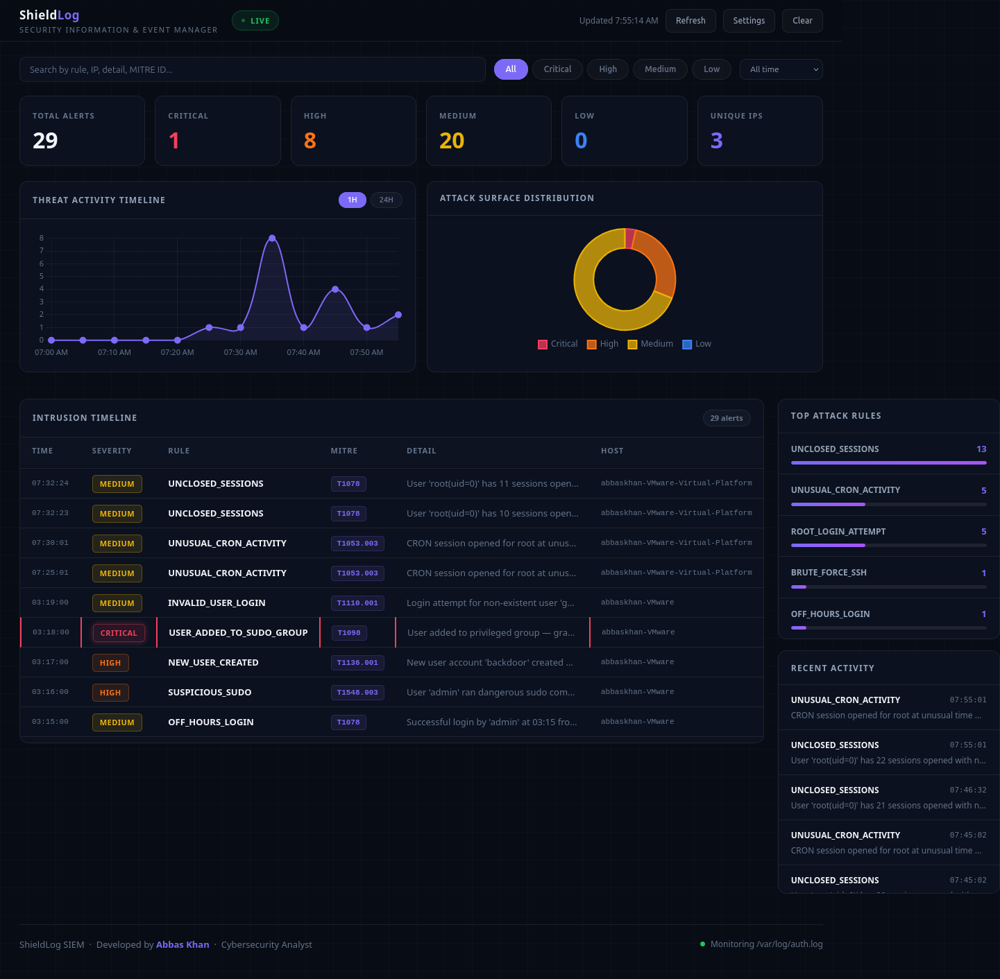

# ShieldLog SIEM

A real-time Security Information and Event Management (SIEM) system built in Python. Monitors Linux auth logs, detects attacks using 18 detection rules mapped to MITRE ATT&CK, and displays live alerts on a web dashboard.



---

## What It Does

ShieldLog watches `/var/log/auth.log` continuously in the background. When it detects suspicious activity — brute force attacks, privilege escalation, backdoor accounts — it fires an alert instantly and displays it on a live web dashboard at `http://localhost:5000`.

This is the same concept used by enterprise SIEM tools like Splunk, IBM QRadar, and Microsoft Sentinel — built from scratch in Python.

---

## Dashboard Features

- Live alert table with severity color coding
- Threat activity timeline chart
- Attack surface distribution pie chart
- Clickable alerts with full detail popup and MITRE explanation
- Search and filter by severity, rule, IP, MITRE ID
- Dark and light mode toggle
- Pause and resume live monitoring
- Auto refreshes every 5 seconds
- Runs as a background service — no terminal needed

---

## Detection Rules — 18 Rules Across 5 Categories

### Category 1 — Authentication Attacks

| Rule | MITRE | Severity | Description |
|---|---|---|---|
| BRUTE_FORCE_SSH | T1110.001 | CRITICAL/HIGH | 5+ failed SSH logins from same IP in 60 seconds |
| DISTRIBUTED_BRUTE_FORCE | T1110.003 | CRITICAL | Failed logins from 5+ different IPs in same minute |
| ROOT_LOGIN_ATTEMPT | T1078.003 | HIGH | Any direct root SSH login attempt |
| INVALID_USER_LOGIN | T1110.001 | MEDIUM | Login attempt for non-existent username |
| OFF_HOURS_LOGIN | T1078 | MEDIUM | Successful login between 10pm and 6am |
| LOGIN_FROM_NEW_IP | T1078 | MEDIUM | User logs in from an IP never seen before |
| CREDENTIAL_STUFFING | T1110.003 | HIGH | Same IP tries 3+ different usernames |

### Category 2 — Privilege Escalation

| Rule | MITRE | Severity | Description |
|---|---|---|---|
| SUSPICIOUS_SUDO | T1548.003 | HIGH | Dangerous sudo commands — /bin/bash, /bin/sh, passwd |
| REPEATED_SUDO_FAILURE | T1548.003 | MEDIUM | 3+ failed sudo attempts by same user |
| USER_ADDED_TO_SUDO_GROUP | T1098 | CRITICAL | User added to sudo or admin group |

### Category 3 — Persistence

| Rule | MITRE | Severity | Description |
|---|---|---|---|
| NEW_USER_CREATED | T1136.001 | HIGH | New user account created — potential backdoor |
| PASSWORD_CHANGED | T1098.001 | MEDIUM | Password change command executed via sudo |
| SSH_KEY_ACTIVITY | T1098.004 | HIGH | SSH authorized_keys file activity detected |
| UNUSUAL_CRON_ACTIVITY | T1053.003 | MEDIUM | CRON session opened for root at unusual time |

### Category 4 — Reconnaissance

| Rule | MITRE | Severity | Description |
|---|---|---|---|
| RAPID_SUCCESSIVE_LOGINS | T1078 | MEDIUM | Same user logs in 3+ times in 2 minutes |
| MULTI_SERVICE_SCAN | T1046 | HIGH | Same IP accesses 3+ different services in 5 minutes |

### Category 5 — Anomaly and Behavioral

| Rule | MITRE | Severity | Description |
|---|---|---|---|
| UNCLOSED_SESSIONS | T1078 | MEDIUM | User has 10+ sessions opened with no matching close |
| LOGIN_SPIKE_ANOMALY | T1078 | HIGH | 20+ login events in current hour |

---

## Tech Stack

| Component | Technology |
|---|---|
| Language | Python 3.10+ |
| Web framework | Flask |
| Frontend | HTML, CSS, JavaScript |
| Charts | Chart.js |
| Log source | /var/log/auth.log |
| Service manager | systemd |
| Detection logic | Custom Python — regex + stateful analysis |

---

## Installation — Any Ubuntu Machine
```bash
git clone https://github.com/cod735/shieldlog-siem.git
cd shieldlog-siem
sudo bash install.sh
```

Open browser and go to `http://localhost:5000`

---

## Project Structure
```
shieldlog-siem/
├── main.py                 — Flask server + log watcher + threading
├── parser.py               — Parses raw auth.log lines into structured data
├── detections.py           — 18 detection rules across 5 MITRE categories
├── generate_test_logs.py   — Simulates attack scenarios for testing
├── install.sh              — One command installer for any Ubuntu machine
├── uninstall.sh            — Clean removal script
├── alerts.json             — Persistent alert storage
├── templates/
│   └── index.html          — ShieldLog dashboard UI
└── screenshot.png          — Dashboard preview
```

---

## How It Works
```
/var/log/auth.log  →  parser.py  →  detections.py  →  alerts.json
                                          ↓
                                     main.py (Flask)
                                          ↓
                                  localhost:5000 (Dashboard)
```

---

## Sample Alert Output
```json
{
  "rule": "BRUTE_FORCE_SSH",
  "mitre": "T1110.001",
  "severity": "CRITICAL",
  "detail": "8 failed SSH logins from 10.0.0.5 in 60 seconds",
  "timestamp": "2026-03-17 03:00:13",
  "host": "ubuntu-server"
}
```

---

## Developer

**Abbas Khan**  
Cybersecurity Analyst

---

## License

MIT License — free to use, modify, and distribute.
